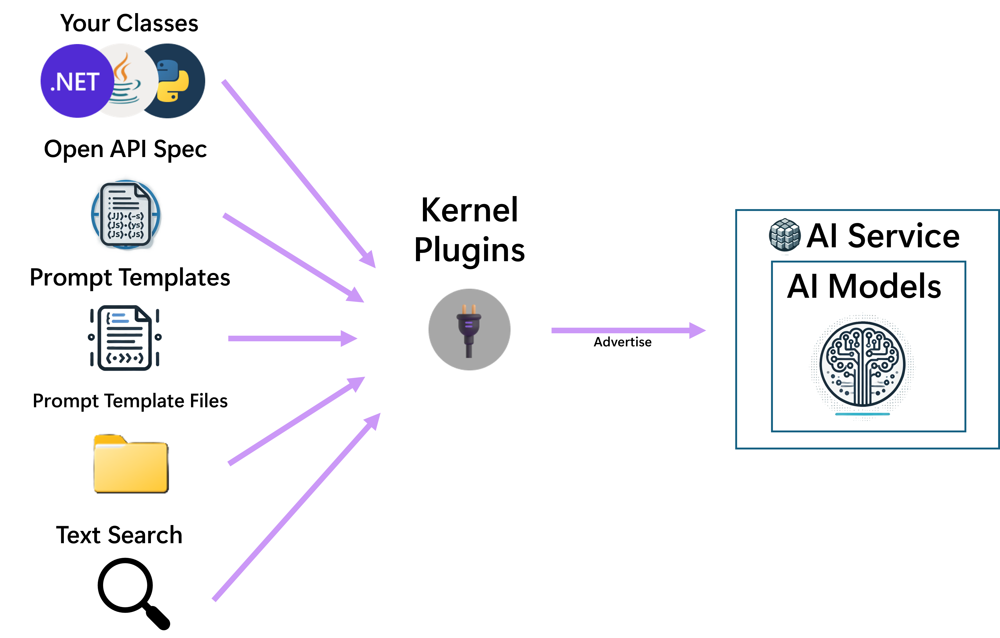

# Components

Semantic Kernel 由多個可獨立或組合使用的元件構成。

## AI 服務連接器 (AI Service Connectors)

**功能**: 提供一個抽象層，透過通用介面連接來自不同供應商的多種 AI 服務。

**支援服務**: 
    * 聊天完成 (Chat Completion)
    * 文字生成 (Text Generation)
    * 嵌入生成 (Embedding Generation)
    * 文字轉圖片 (Text to Image)
    * 圖片轉文字 (Image to Text)
    * 文字轉語音 (Text to Audio) 
    * 語音轉文字 (Audio to Text)。

**核心整合**: Kernel 預設會使用註冊的「聊天完成」或「文字生成」服務。其他服務不會自動使用。

## 向量儲存（記憶體）連接器 (Vector Store (Memory) Connectors)

**功能**: 提供一個抽象層，透過通用介面連接來自不同供應商的向量儲存。

**核心整合**: Kernel 不會自動使用註冊的向量儲存。但可以將向量搜尋 (Vector Search) 功能作為外掛程式公開給 Kernel，使其可用於提示詞模板和聊天完成 AI 模型。

## 函式與外掛程式 (Functions and Plugins)

**定義**: 外掛程式 (Plugins) 是具名函式 (Functions) 的容器。

**核心整合：** 註冊到 Kernel 後，外掛程式有兩種用途：
1.  **告知 AI：** 讓聊天完成 AI 知道這些函式存在，並可在需要時選擇呼叫它們 (Function Calling)。
2.  **模板呼叫：** 讓提示詞模板在渲染過程中可以直接呼叫這些函式。

**函式來源：** 可以從多種來源輕鬆建立函式，包括：
*   原生程式碼 (Native code)
*   OpenAPI 規格
*   用於 RAG 場景的 `ITextSearch` 實作
*   提示詞模板

## 提示詞模板 (Prompt Templates)

**功能：** 允許開發者或提示詞工程師建立一個混合了 AI 指令、上下文、使用者輸入和函式輸出的模板。模板可以包含硬編碼的函式呼叫。

**使用方式：**
1.  **啟動流程：** 作為聊天完成流程的起點，Kernel 會渲染模板並將結果傳遞給 AI 模型。
2.  **作為外掛函式：** 將模板本身註冊為一個外掛函式，使其能像其他函式一樣被呼叫（可能由 AI 決定呼叫）。

**複雜流程：** 將模板作為函式使用可能導致複雜的執行流程（例如，模板 B 呼叫模板 A）。

**優點：** 允許用自然語言描述功能，並將其封裝成獨立的外掛，有助於 AI 模型更專注地處理單一問題，提高成功率。

## 篩選器 (Filters)

**功能：** 提供在特定事件（函式呼叫前後、提示詞渲染前後）執行自訂動作的方法。

**核心整合：** 需要註冊到 Kernel 才能在流程中被觸發。

**與模板的關係：** 由於提示詞模板在執行前總會轉換為 KernelFunctions，因此函式篩選器和提示詞篩選器都會對模板生效。函式篩選器在外層，提示詞篩選器在內層。

