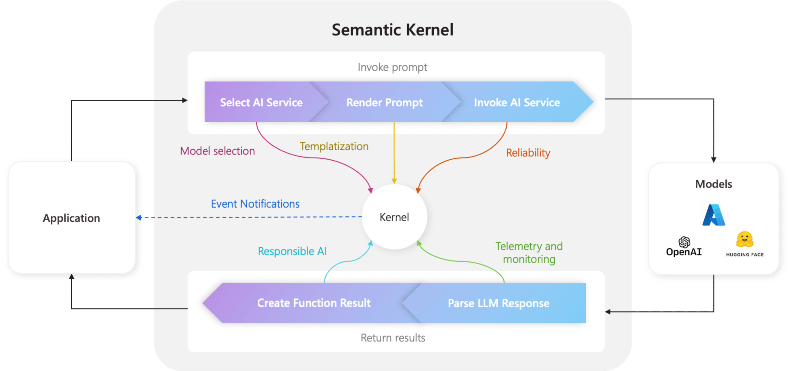

# Semantic Kernel

## 核心概念
*   **Kernel 是 Semantic Kernel 的核心組件**。
*   它扮演著**依賴注入 (Dependency Injection) 容器**的角色，管理運行 AI 應用所需的所有服務 (Services) 和插件 (Plugins)。



## 主要功能與重要性
**集中管理**：Kernel 統一管理所有服務和插件，讓 AI 在需要時能無縫使用它們。

**連接原生代碼與 AI 服務**：幾乎所有 Semantic Kernel SDK 中的組件都使用 Kernel 來驅動 Agent，連接原生代碼和 AI 服務。

**單一配置與監控點**：開發者可以在 Kernel 這個單一位置配置和監控 AI Agent 的行為。

**執行流程控制**：當透過 Kernel 調用提示 (Prompt) 時，它會執行以下步驟：
1.  選擇最適合的 AI 服務。
2.  使用提示模板建立提示。
3.  將提示發送給 AI 服務。
4.  接收並解析回應。
5.  將 LLM 的回應返回給應用程式。

**事件與中介軟體**：可在上述流程的每個步驟中創建事件和中介軟體，用於日誌記錄、狀態更新、實現負責任 AI 等。

## 主要組件
**服務 (Services)**：
*   包含 AI 服務 (如：聊天完成) 和其他運行應用所需的服務 (如：日誌記錄、HTTP 客戶端)。
*   支援跨語言的依賴注入。

**插件 (Plugins)**：
*   供 AI 服務和提示模板使用的組件，用於執行具體工作。
*   例如：從資料庫檢索數據、調用外部 API 執行操作。

## 如何建立 Kernel
**Python**：
*   初始化 `Kernel()`。
*   使用 `kernel.add_service()` 添加 AI 服務 (如 `AzureChatCompletion`)。
*   使用 `kernel.add_plugin()` 添加插件。

## 範例

```python
from semantic_kernel import Kernel
from semantic_kernel.connectors.ai.open_ai import OpenAIChatCompletion
from semantic_kernel.core_plugins.time_plugin import TimePlugin

# Initialize the kernel
kernel = Kernel()

# Add the Azure OpenAI chat completion service
kernel.add_service(OpenAIChatCompletion(ai_model_id, async_client))

# Add a plugin
kernel.add_plugin(
    TimePlugin(),
    plugin_name="TimePlugin",
)
```